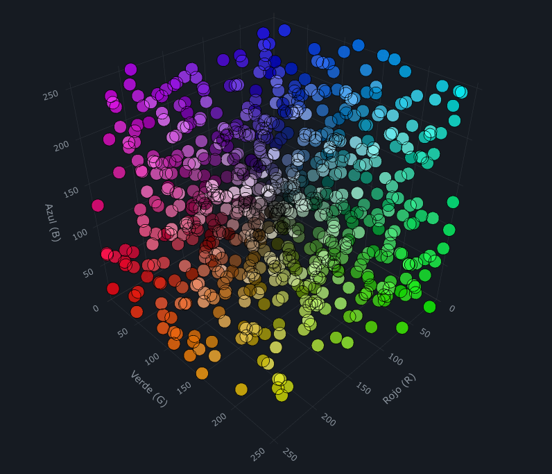

# Generador de Números Aleatorios Híbrido (Física + Cuántica)

El objetivo del proyecto es demostrar los riesgos de seguridad asociados al uso de generadores de números pseudoaleatorios (PRNG) matemáticos en lógicas críticas de negocio (como la generación de tokens para reseteo de contraseñas) y proponer una solución robusta basada en la captura de entropía híbrida del mundo físico y de la mecánica cuántica.

El proyecto simula un escenario real: una API con autenticación y almacenamiento en memoria (SQLite en RAM) que contiene un usuario administrador, y un script de ataque capaz de secuestrar dicha cuenta cuando se utiliza el método de aleatoriedad vulnerable, pero que falla completamente frente al método seguro.

## Estructura del Repositorio

* **`api.py`**: Aplicación web construida con FastAPI que expone endpoints para el inicio de sesión, cambio de contraseñas y dos métodos de solicitud de reseteo de tokens (uno vulnerable y uno seguro).
* **`attacker.py`**: Script de simulación que actúa como el atacante. Intenta explotar la predictibilidad matemática para adivinar tokens de reseteo y tomar control de la cuenta del administrador utilizando álgebra de bits.
* **`index.html`**: Dashboard interactivo de auditoría visual impulsado por Plotly.js para comprobar empíricamente la pureza y distribución uniforme de la entropía cruda generada en tiempo real.
* **`frame.png`**: Imagen estática local que actúa como la fuente de entropía visual macroscópica (simulando un feed de video en vivo).
* **`requirements.txt`**: Archivo con las dependencias necesarias para la ejecución del proyecto.

---

## ¿Cómo funciona la generación de números?

La tesis central de este proyecto es el contraste entre el **determinismo matemático** y la **incertidumbre física/cuántica**. El repositorio permite evaluar y contrastar ambos enfoques bajo las mismas condiciones arquitectónicas emitiendo tokens de gran longitud (256 bits):

### 1. El Método Vulnerable (Mersenne Twister)

Invocado a través del endpoint `/request_reset/{username}`, utiliza la librería estándar de Python (`random.getrandbits(256)`).

* **El Algoritmo:** Utiliza **Mersenne Twister** (MT19937). Aunque posee un período sumamente extenso ($2^{19937}-1$) y una excelente distribución estadística para simulaciones o modelos probabilísticos, **no es criptográficamente seguro**.
* **La Vulnerabilidad:** El algoritmo es una ecuación determinista que mantiene un estado interno compuesto por una matriz rígida de **624 enteros de 32 bits**. Cada nuevo número se genera aplicando transformaciones matemáticas lógicas (*shifts* y *XOR*) sobre este estado.
* **El Quiebre:** Debido a su naturaleza puramente matemática, si un atacante logra extraer la información equivalente a 624 salidas consecutivas de 32 bits, recopila los datos suficientes para resolver la ecuación inversa, clonar el estado interno del servidor y predecir con un 100% de precisión cualquier secuencia que se genere a continuación.

### 2. El Método Seguro (Entropía Híbrida)

Invocado a través del endpoint `/secure_request_reset/{username}`, este método reemplaza las ecuaciones matemáticas por leyes de la física a través de un proceso de cuatro etapas consecutivas:

#### Etapa A: Determinación de Coordenadas Cuánticas (Qiskit)

En lugar de calcular una posición mediante software tradicional, se delega la decisión en la mecánica cuántica utilizando la librería `Qiskit` y el simulador local `AerSimulator`:

1. Se inicializa un circuito cuántico donde cada qubit se somete a una **Compuerta Hadamard (H)**.
2. Esta compuerta coloca a los qubits en un estado de **superposición perfecta** (una probabilidad exacta del 50% de colapsar en 0 y 50% de colapsar en 1).
3. Al realizar la medición (`measure`), el estado colapsa de forma verdaderamente impredecible en bits clásicos. Estos bits se agrupan para dar origen a dos enteros aleatorios que se utilizarán como coordenadas espaciales: **X** e **Y**.

#### Etapa B: Captura de Entropía Macroscópica (Pillow + Imagen)

Con las coordenadas cuánticas puras obtenidas, el sistema interactúa con el mundo físico:

1. Se lee el archivo `frame.png` (que representa un instante congelado de un feed caótico real, como una cámara enfocando un acuario, tráfico urbano o interferencia).
2. Se extrae el valor de color analógico exacto de los canales de color en esas coordenadas específicas: `img.getpixel((x, y))`.
3. Aquí se captura el caos macroscópico del entorno: ruido térmico del sensor de imagen, fluctuaciones lumínicas imperceptibles y la distribución entrópica del escenario visual.

#### Etapa C: Blanqueamiento de Entropía (Entropy Whitening)

Para evitar el fenómeno criptográfico de *Sesgo de Histograma* (Histogram Bias) —donde la paleta de colores predominante de la imagen física agrupa la entropía predeciblemente en ciertos rangos tonales— se aplica un desacople lógico:

1. Se genera una cadena adicional de 24 qubits de entropía cuántica, estrictamente independientes de los utilizados para decidir las coordenadas.
2. Estos bits cuánticos puros actúan como una máscara de enmascaramiento utilizando el operador lógico `XOR` contra los valores físicos extraídos de los canales RGB.
3. El resultado es una señal de Ruido Blanco perfecta, garantizando una distribución entrópica uniforme sin importar las condiciones de iluminación o la naturaleza monocromática del video de origen.

#### Etapa D: Fusión Criptográfica (SHA-256)

Para transformar este flujo de caos físico y cuántico en un formato compatible con los sistemas informáticos tradicionales:

1. Se amalgaman las variables blanqueadas en una cadena única de texto estructurado: `X:x-Y:y-R:r-G:g-B:b`.
2. Dicha cadena se procesa a través del algoritmo de hash criptográfico **SHA-256**. Esta función actúa como una licuadora de bits que implementa el *efecto avalancha*: si un solo bit o un canal de color varía mínimamente, el hash resultante cambia drásticamente de forma impredecible.
3. El hash hexadecimal de 256 bits resultante se transforma directamente en un número entero gigante. Dado que este tamaño excede el límite físico de 64 bits de motores relacionales estandarizados como SQLite, el token se convierte a formato de texto (`String`) para su correcto almacenamiento en base de datos y transmisión mediante la API.

---

## Auditoría Visual de la Entropía

Para garantizar de manera auditable que la aleatoriedad generada es criptográficamente robusta antes de ser inyectada en la etapa de hash, el proyecto incluye un frontend de visualización web (`index.html`). Este dashboard consume directamente el motor de entropía cruda de la API (`/raw_entropy`) y grafica los resultados dinámicamente en un espacio tridimensional.



Como se puede apreciar en la imagen, los resultados obtenidos son excelentes. Gracias a la etapa de *Entropy Whitening* (Blanqueamiento XOR), se logra erradicar por completo los sesgos de color y patrones físicos de la imagen de origen (el clásico *Histogram Bias*). En lugar de ver agrupaciones o zonas vacías, el gráfico muestra una nube de estática tridimensional perfecta, ocupando todos los rincones del espacio RGB. Esto demuestra visualmente que se alcanza una distribución uniforme ideal, validando la robustez de la fuente de entropía en tiempo real.

---

## Consideración Técnica: Mitigación de Modulo Bias (Rejection Sampling)

Un problema común al ajustar números aleatorios a un rango específico utilizando la operación matemática de módulo (`%`) es la introducción de un levísimo sesgo estadístico conocido como **Modulo Bias**. Esto ocurre porque el espacio de estados máximo del generador rara vez es un múltiplo exacto del límite deseado, otorgando mayor probabilidad de selección a los valores inferiores de la imagen.

Para evitar esto y garantizar una entropía criptográficamente perfecta con una distribución estrictamente uniforme (0% de sesgo) en las coordenadas espaciales **X** e **Y**, el motor central implementa de forma nativa **Rejection Sampling (Muestreo por Descarte)**. En lugar de forzar numéricamente el píxel a encajar deformando la probabilidad estadística, se extrae la cantidad exacta de qubits (`bit_length()`) para la resolución visual en juego y, si la medición clásica llega a asomar por fuera de los límites de la imagen, simplemente se rechaza la tirada y el simulador cuántico efectúa una medición completamente nueva. Esto elimina la principal deficiencia de la entropía proyectada manteniendo la pureza de los datos.

---

## Demostración del Ataque en Vivo

El script `attacker.py` ejecuta una prueba en dos actos bien diferenciados para evidenciar la resiliencia del sistema ante un jurado:

1. **Acto 1 (Ataque Exitoso con Bit-Slicing):** El script realiza **78 peticiones** al endpoint vulnerable bajo la identidad de un usuario común (`hacker`). Al recibir tokens colosales de 256 bits, el script utiliza operaciones lógicas a nivel de bits (*desplazamientos* y *máscaras*) para dividir (splitear) cada token en **8 bloques de 32 bits** (78 peticiones $\times$ 8 bloques = 624 estados interceptados). Con estos fragmentos, la librería `randcrack` reconstruye el estado interno del Mersenne Twister del servidor. El atacante predice los siguientes 8 bloques, los ensambla matemáticamente para forjar un nuevo token de 256 bits, y lo utiliza para interceptar el reseteo y tomar el control de la cuenta del `admin`.
2. **Pausa de Control:** El script se detiene en la terminal y solicita la intervención del presentador presionando la tecla `ENTER`.
3. **Acto 2 (Mitigación Absoluta):** Al reanudar la ejecución, se lanza exactamente la misma estrategia hostil contra el endpoint seguro (`/secure_request_reset`). El script recolecta 78 tokens gigantes generados mediante el proceso híbrido e intenta dividirlos de la misma manera. Sin embargo, al carecer el nuevo sistema de una máquina de estados matemática subyacente que clonar, la predicción de los próximos fragmentos falla en su totalidad. La forja del token final resulta en una credencial inválida, la API deniega el intento de cambio de contraseña del administrador y el ataque queda mitigado exitosamente.

## Instrucciones de Ejecución

### Requisitos Previos

Asegúrate de contar con Python 3.10+ e instalar las dependencias requeridas del sistema:

```bash
pip install -r requirements.txt

```

### Paso 1: Inicializar el Servidor

En la primera terminal, levanta la API de evaluación:

```bash
python api.py

```

*Nota: Asegúrate de tener una imagen estática con el nombre `frame.png` alojada en el mismo directorio de ejecución para proveer el caos físico.*

### Paso 2: Auditoría Visual (Opcional)

Abre el archivo `index.html` en cualquier navegador web para visualizar la recolección de entropía híbrida en tiempo real y observar el dashboard de distribución 3D del proyecto interactuando de forma paralela con el backend.

### Paso 3: Lanzar el Script Atacante

En una segunda terminal independiente, ejecuta la simulación de secuestro de cuenta:

```bash
python attacker.py

```

Sigue el output y el flujo lógico en la consola de comandos para observar cómo se desenvuelve exitosamente el exploit de clonación de estados y la posterior demostración de la mitigación de la amenaza en el entorno seguro.